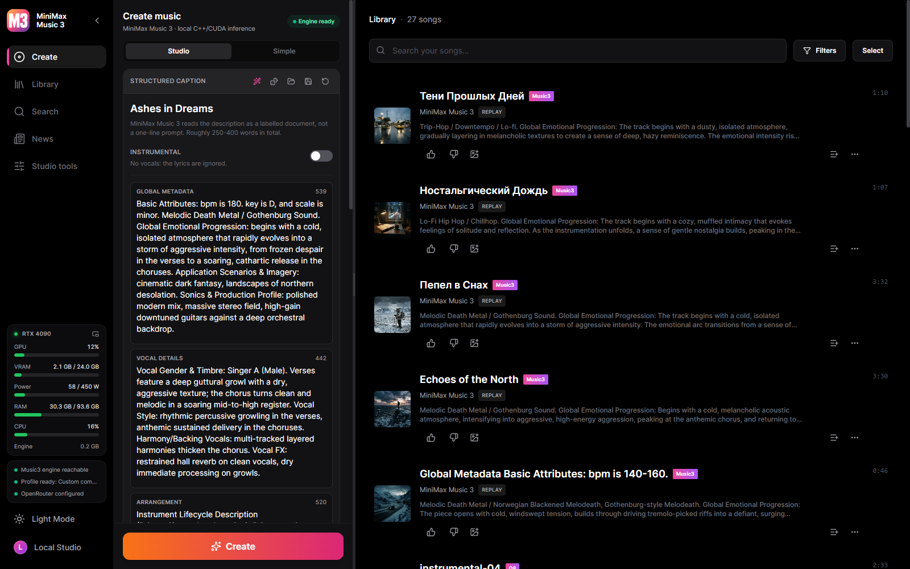
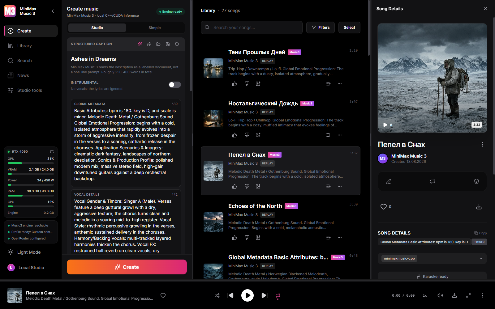
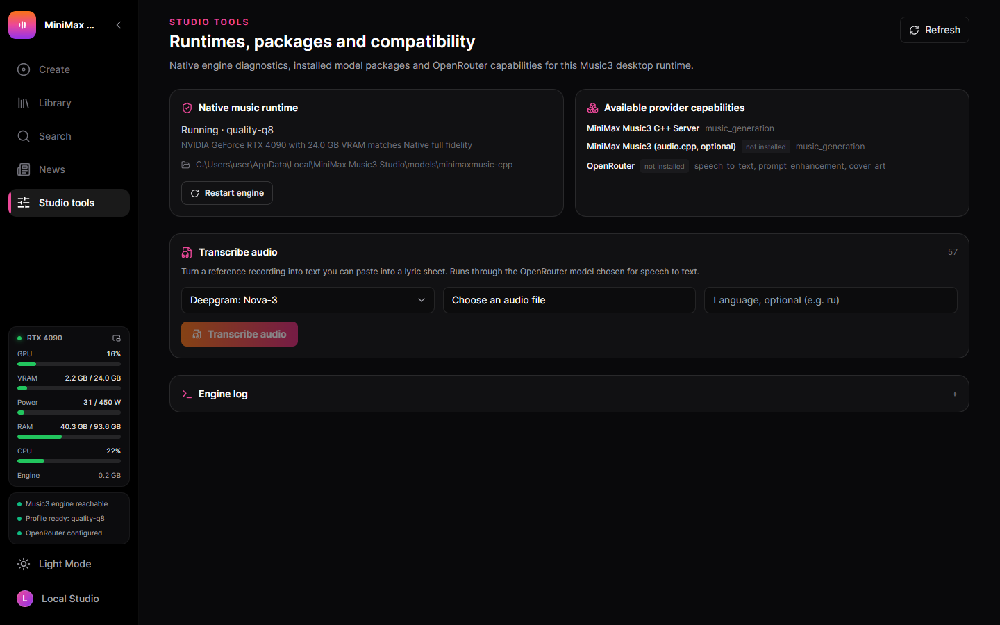
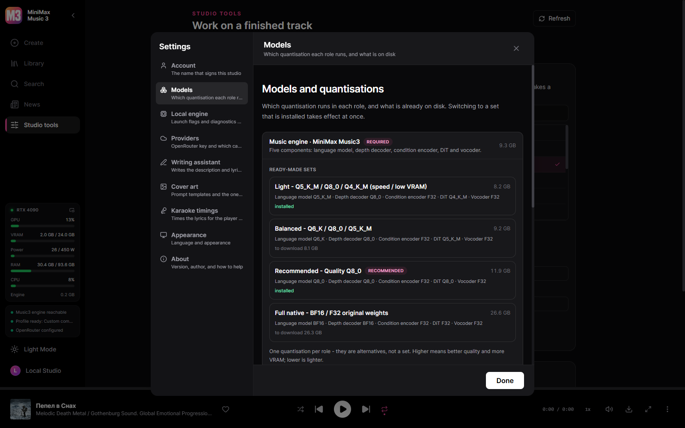
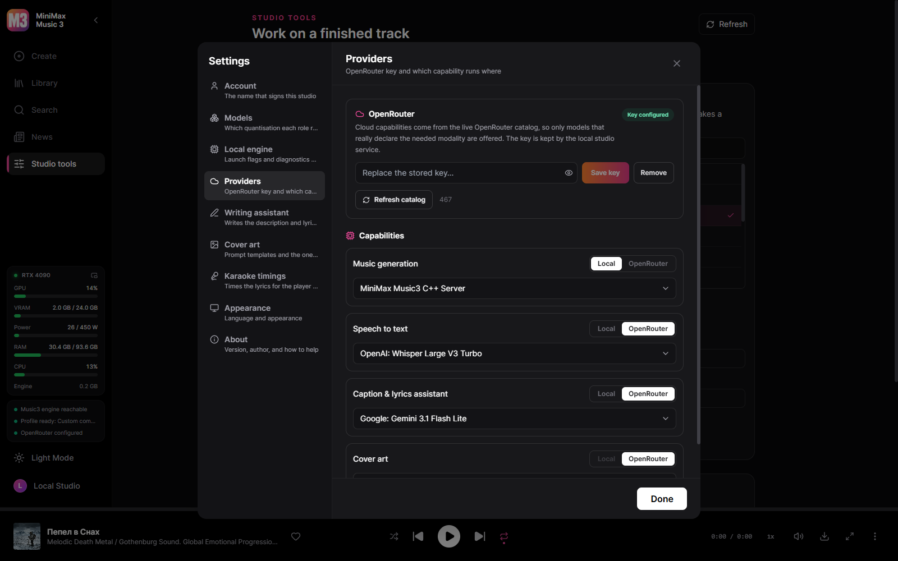
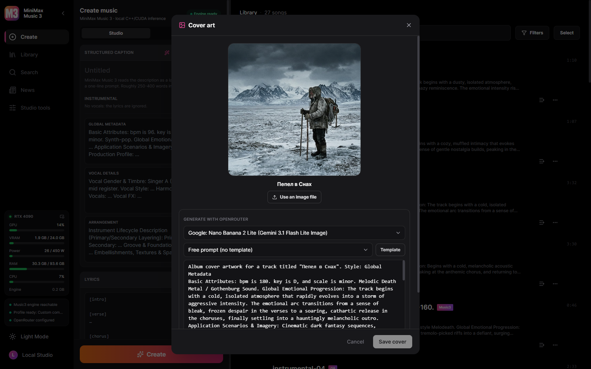
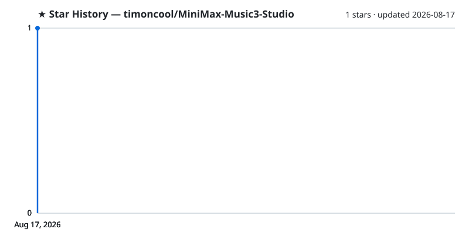

<div align="center">


# MiniMax Music3 Studio

**Full-length AI music on your own GPU. One executable — no Python, no Node.js, no launcher.**

[](https://timoncool.github.io/MiniMax-Music3-Studio/)
[](https://github.com/timoncool/MiniMax-Music3-Studio/releases/latest)
[](DONATE.md)

[](https://github.com/timoncool/MiniMax-Music3-Studio/stargazers)
[](LICENSE)
[](https://github.com/timoncool/MiniMax-Music3-Studio/commits/main)
[](https://github.com/timoncool/MiniMax-Music3-Studio/issues)

[](#architecture)
[](#architecture)
[](#architecture)
[](#models)

**English** · [Русский](https://timoncool.github.io/MiniMax-Music3-Studio/ru.html) · [中文](https://timoncool.github.io/MiniMax-Music3-Studio/zh.html) · [日本語](https://timoncool.github.io/MiniMax-Music3-Studio/ja.html) · [한국어](https://timoncool.github.io/MiniMax-Music3-Studio/ko.html)



</div>

A Windows desktop studio for **MiniMax Music3**. Write a caption and lyrics, generate a
full-length track on your own GPU, and keep everything — audio, settings and the exact
request that produced it — in a local library.

One executable. No Python, no Node.js, no launcher script, nothing phoning home unless you
ask it to.

## What you can do

- **Generate music locally** with the complete Music3 component set: caption, lyrics,
  duration, DiT steps, LM CFG and top-k, DiT CFG, peak clip, separate DiT and LM seeds,
  several songs per prompt and several variations per song, MP3 or 16/24/32-bit WAV.
- **Reproduce any track exactly.** Every generation stores its request and its audio codes,
  so a track can be re-rendered deterministically, or re-rendered with different steps,
  seed or output format.
- **Word-level karaoke** — enhanced LRC with a timestamp on every word, aligned by
  Parakeet, Whisper or a cloud model. Your lyrics are kept; only the timing is borrowed.
- **Karaoke video** written with the bundled ffmpeg, hardware-encoded when the machine can
  and software-encoded when it cannot.
- **A writing assistant** for captions and lyrics, from a local GGUF model or OpenRouter,
  following MiniMax's own published prompting skill.
- **Cover art from templates** — write the look once with `{title}`, `{style}` and
  `{excerpt}`, and the track fills the rest in.
- **Manage your library** — search, playlists, favourites, rename, import your own audio,
  export tracks, edit audio in the built-in editor.
- **Watch what generation costs** — live GPU load, VRAM, temperature, power draw, RAM and
  engine memory, in the sidebar or in a pop-out panel.
- **Add cloud capabilities when you want them.** Speech-to-text, a caption/lyrics
  assistant, cover art and cloud music can each independently use OpenRouter, chosen from
  the live model catalog. Local stays the default.
- **Split a finished track into six stems** — drums, bass, other, vocals, guitar and
  piano — with HT-Demucs on the GPU, or on the CPU when you prefer. The model is an
  optional download like everything else.
- **Export files that carry their own data** — MP3s are written with ID3v2.4: title,
  artist, album, genre, tempo, the lyrics and the cover art.
- **Choose your own quality/VRAM trade-off** in the model manager. Nothing downloads by
  itself.

## Screenshots

| | |
|---|---|
|  |  |
| A finished track — cover, timed lyrics, the request that made it | Studio tools — six-stem separation on the GPU, transcription, editor |
|  |  |
| Model sets — one quantisation per role, switchable once installed | Every capability runs where you say, local or OpenRouter |
|  |  |
| Cover art — large preview, prompt templates filled from the track | Writing a track — the caption as a document, every parameter a slider |

The same six screens are in the interface language you read: [Русский](https://timoncool.github.io/MiniMax-Music3-Studio/ru.html),
[中文](https://timoncool.github.io/MiniMax-Music3-Studio/zh.html), [日本語](https://timoncool.github.io/MiniMax-Music3-Studio/ja.html),
[한국어](https://timoncool.github.io/MiniMax-Music3-Studio/ko.html) — on the project page, or in
[docs/screenshots](docs/screenshots).

## What it needs

Windows 10/11 x64 and an NVIDIA card of the **GTX 16 / RTX 20 generation or newer** —
Turing, Ampere, Ada and Blackwell. The engine ships compiled for those architectures;
Pascal and older (GTX 10 series and down) are not supported, because the CUDA 13 toolkit
that builds it dropped them.

## Models

A runnable Music3 installation is always five components: language model, RVQ depth
decoder, condition encoder, DiT and vocoder.

| Your GPU | Recommended profile | Download |
| --- | --- | --- |
| 20 GB VRAM and above | Full Native — BF16 / BF16 / F32 | 28.6 GB |
| 10 GB and above | Q8 Quality | 12.8 GB |
| 9 GB tier | Light — for speed and low VRAM | 8.8 GB |

The studio detects your GPU and preselects the profile it can actually run, but the
download is always your decision. Every component is checksum-verified against a pinned
Hugging Face revision and downloads resume where they stopped.

## Architecture

```text
React UI ─┐
          ├─ MiniMax Music3 Studio.exe   (window + native service)
Rust axum ┘        │
                   └─ minimaxmusic.cpp `mm-server`  (C++/CUDA, GGUF)
```

The service is compiled into the desktop binary and supervises the C++ engine. Cloud
capabilities go through a capability catalog fetched live from OpenRouter, so the studio
never offers a model that does not declare the modality it would be used for.

Music generation, speech-to-text, the assistant and cover art are configured
independently, which makes fully local, fully cloud and hybrid setups possible without
changing anything about how projects are stored.

## Building from source

```powershell
npm --prefix app install
npm --prefix desktop install
npm --prefix desktop run build      # the studio executable
cargo test --workspace
```

Developing the UI against a running service:

```powershell
cargo run -p music-server           # service on 127.0.0.1:8765
npm --prefix app run dev            # UI on 127.0.0.1:3000
```

### Native engine

`scripts/build-minimax-runtime.ps1` builds the pinned `minimaxmusic.cpp` runtime. Releases
always stage a universal CUDA build; a card-specific build is for local testing only:

```powershell
scripts\build-minimax-runtime.ps1 -OutputDirectory .\build\engine -RuntimeBackend cuda -CudaArchitecture native
```

### Release

`scripts/build-release.ps1 -Version X.Y.Z` produces the NSIS installer, a portable
archive and a signed `latest.json` for the in-app updater. It requires
`TAURI_SIGNING_PRIVATE_KEY`, `TAURI_SIGNING_PRIVATE_KEY_PASSWORD` and
`TAURI_UPDATER_PUBKEY`, and refuses to run without them. Model weights are never included
in an installer.

## Other Projects by [@timoncool](https://github.com/timoncool)

| Project | Description |
|---------|-------------|
| [ACE-Step Studio](https://github.com/timoncool/ACE-Step-Studio) | Local AI music generation on ACE-Step — the studio this one grew out of |
| [ACE-Step Studio · Pinokio](https://github.com/timoncool/ACE-Step-Studio-pinokio) | One-click cross-platform launcher for ACE-Step Studio |
| [telegram-api-mcp](https://github.com/timoncool/telegram-api-mcp) | Full Telegram Bot API as an MCP server |
| [civitai-mcp-ultimate](https://github.com/timoncool/civitai-mcp-ultimate) | Civitai search, downloads and trend analysis over MCP |

## Support the Author

I build open-source software and do AI research. Most of what I create is free and available to everyone. Your donations help me keep creating without worrying about where the next meal comes from =)

**[All donation methods](DONATE.md)** · [Русский](DONATE.ru.md) · [中文](DONATE.zh.md) · [日本語](DONATE.ja.md) · [한국어](DONATE.ko.md) | **[dalink.to/nerual_dreming](https://dalink.to/nerual_dreming)** | **[boosty.to/neuro_art](https://boosty.to/neuro_art)**

- **BTC:** `1E7dHL22RpyhJGVpcvKdbyZgksSYkYeEBC`
- **ETH (ERC20):** `0xb5db65adf478983186d4897ba92fe2c25c594a0c`
- **USDT (TRC20):** `TQST9Lp2TjK6FiVkn4fwfGUee7NmkxEE7C`

## Star History

<a href="https://github.com/timoncool/MiniMax-Music3-Studio/stargazers">
 <picture>
   <source media="(prefers-color-scheme: dark)" srcset="docs/stars-dark.svg" />
   <source media="(prefers-color-scheme: light)" srcset="docs/stars-light.svg" />
   
 </picture>
</a>

## Licensing

This studio is a fork of ACE-Step Studio with ACE inference replaced by MiniMax Music3;
the ACE sources live in their own repository. MiniMax Music3 weights are governed by their
own community license — commercial use must display the MiniMax-Music3 name and implement
the safeguards that license requires.

What changed and when is in [CHANGELOG.md](CHANGELOG.md).
