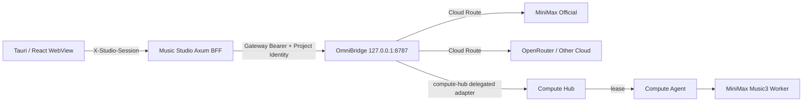

# MiniMax Music3 Studio 整改与 OmniBridge / Compute Hub 本地整合方案

> 状态：待开发  
> 目标分支：`main`  
> 适用仓库：`knownothing20/MiniMax-Music3-Studio`、`knownothing20/omnibridge`、`knownothing20/compute-hub`  
> 原则：先安全整改，再统一控制面；先兼容现有能力，再逐步迁移权责；不重复造 Provider、队列和本地调度器。

---

## 1. 目标与结论

本方案不是把 OmniBridge、Compute Hub 代码直接塞进 MiniMax Music3 Studio，而是把三者按职责组成一条稳定的本地/云端音乐生成链路：

```text
MiniMax Music3 Studio
  产品 UI / Library / 编辑 / 歌词 / 播放 / 业务状态
                 │
                 │ 可信后端调用
                 ▼
             OmniBridge
  Provider / Credential / Route / Receipt / Durable Job
        │                         │
        │ Cloud                   │ Local delegated job
        ▼                         ▼
MiniMax Official / OpenRouter   Compute Hub
                                Scheduler / Lease / Artifact
                                       │
                                       ▼
                                Compute Agent
                                       │
                                       ▼
                           MiniMax Music3 Worker
                           minimaxmusic-cpp / mm-server
```

### 最终架构决策

1. **Music Studio 是产品层，不再成为模型网关。**
2. **OmniBridge 是 Studio 唯一的 AI / 生成控制入口。** Studio 不直接保存 MiniMax、OpenRouter 等 Provider Key，也不直接管理 Provider URL、候选顺序或安全 fallback。
3. **Compute Hub 是本地/共享 GPU 任务的唯一 durable 调度层。** Studio 不新增第二套 Compute Hub Client，不自己复制 Lease、Artifact、恢复和并发调度逻辑。
4. **OmniBridge 负责把本地音乐任务委派给 Compute Hub。** Studio 仍只看到 OmniBridge 的 parent job、Receipt 和 ArtifactRef。
5. **现有 Studio 直连本地 `mm-server` 路径暂时保留为迁移期 Legacy Fallback。** 新功能不继续堆在这条路径上；完成 Compute Hub Worker 验收后再决定是否默认关闭或移除。
6. **MiniMax 官方 Music API 应接入 OmniBridge，而不是直接接入 Studio。** 这样 API Key、限流、重试、计费边界、Provider 路由和日志脱敏只实现一次。

---

## 2. 当前代码现状与主要问题

以下结论以三个仓库当前 `main` 为基线。

### 2.1 Studio 当前承担了过多运行职责

`crates/music-server/src/lib.rs` 当前同时承担：

- Studio HTTP API；
- `HashMap<String, MusicJob>` 内存任务状态；
- 本地 `MmServerClient`；
- 本地 engine supervisor；
- 模型与 runtime 管理；
- OpenRouter cloud dispatch；
- assistant / transcription / cover / separation；
- Library 写入；
- 图片代理；
- Provider credential 设置。

`MusicJobDispatch` 当前主要是：

```text
NotConfigured
Local
OpenRouter
Cancelled
```

这意味着 Studio 目前既是产品后端，又承担了一部分 Provider Gateway 与本地 Compute Controller 的角色。继续直接增加 MiniMax Official、更多 Cloud Provider、Compute Hub Client，会让三套职责继续耦合。

### 2.2 Provider 层目前只有 OpenRouter

当前：

```text
crates/music-server/src/providers/
├── mod.rs
└── openrouter.rs
```

不建议在这里继续新增：

```text
minimax.rs
mureka.rs
suno.rs
compute_hub.rs
...
```

这些 Provider 与路由职责应统一放到 OmniBridge。

### 2.3 本地 HTTP 安全基线不足

当前 Axum Router 使用：

```rust
.layer(DefaultBodyLimit::max(256 * 1024 * 1024))
.layer(CorsLayer::permissive())
```

问题：

- CORS 允许任意 Origin；
- 256 MB 是全局上限，普通 JSON 设置接口也继承同一限制；
- localhost 本身不是完整的认证边界；
- 如果没有独立 Session Token，恶意网页可能尝试访问本地 API。

### 2.4 Provider Key 当前是本地明文文件

`credentials.rs` 当前将 OpenRouter Key 保存到 Studio 用户数据目录：

```text
openrouter-api-key
```

环境变量优先于本地文件，并且 Key 不会序列化到 settings / job response，这一点是正确的；但生产桌面应用仍不应把长期 Cloud Provider Key 作为普通明文文件保存。

整合 OmniBridge 后，Studio 最终不应再保存 Provider Key。

### 2.5 Image Proxy SSRF 防护不完整

当前 `/v1/proxy/image` 已限制协议为 `http/https`，并显式拒绝：

```text
localhost
127.*
0.0.0.0
[::1]
```

这是好的起点，但还没有形成完整 SSRF 防护边界。至少还需覆盖：

- RFC1918 私网；
- IPv4/IPv6 link-local；
- IPv6 ULA；
- 云 metadata 地址；
- DNS 解析后私网地址；
- redirect 后重新校验；
- DNS rebinding / 多 A/AAAA 记录；
- 下载体积、Content-Type、redirect 次数与超时。

### 2.6 现有 Job 状态不够 durable

Studio 当前 `jobs` 是内存状态。对于本地几十秒到数分钟生成、云端异步任务、应用重启恢复，这不应成为最终的任务事实来源。

目标状态：

- Cloud / delegated local durable job：OmniBridge 是 parent job 事实来源；
- Local GPU execution：Compute Hub 是 child task / lease 事实来源；
- Studio SQLite 只保存业务需要的 handle、展示状态、Receipt 摘要和最终 Library 记录。

---

## 3. 三个项目的职责边界

| 能力 | Music Studio | OmniBridge | Compute Hub |
| --- | --- | --- | --- |
| 音乐创建 UI | ✅ Owner | ❌ | ❌ |
| Lyrics / Prompt 编辑 | ✅ Owner | ❌ | ❌ |
| Library / 播放器 / Track Metadata | ✅ Owner | ❌ | ❌ |
| Provider Key | ❌ | ✅ Owner | ❌ |
| Provider Base URL | ❌ | ✅ Owner | ❌ |
| MiniMax Official Adapter | ❌ | ✅ Owner | ❌ |
| OpenRouter Adapter | 迁移后 ❌ | ✅ Owner | ❌ |
| Route / fallback / provider selection | ❌ | ✅ Owner | ❌ |
| Durable parent job | ❌ | ✅ Owner | ❌ |
| Compute capability readiness | 读取脱敏结果 | ✅ 聚合 | ✅ Owner |
| Local task queue | ❌ | ❌ | ✅ Owner |
| GPU lease / concurrency | ❌ | ❌ | ✅ Owner |
| Worker lifecycle | ❌ | ❌ | ✅ Owner |
| 本地模型运行 | Legacy only | 委派 | ✅ Worker |
| Artifact binary transport | 消费 | ✅ Backend-neutral bridge | ✅ Owner |
| Prompt/Result Receipt | 展示/保存摘要 | ✅ Owner | 私有执行信息 |
| 云端计费/429/Provider 错误 | 展示归一化结果 | ✅ Owner | ❌ |

### 必须避免的反模式

以下实现不得进入最终架构：

- WebView 直接调用 OmniBridge；
- WebView 持有 OmniBridge Gateway Key；
- Studio 直接调用 Compute Hub；
- Studio 再实现一套 Provider CRUD；
- Studio 再实现一套 durable queue；
- Compute Hub task 允许传 shell / exe / cwd / env / 任意 URL；
- Provider Key 写入 Studio SQLite、settings、日志或前端 localStorage；
- 大音频通过 base64 放进 JSON；
- Cloud / Local 在用户不知情时静默互相回退；
- Unknown submission 后自动重新 POST。

---

## 4. 目标调用链

### 4.1 Studio 只接 OmniBridge



### 4.2 音乐生成统一走 OmniBridge durable job

OmniBridge 当前合同已经支持：

```text
operation: audio.music.generate
capability: music_generation
job kind: audio.music_generation
```

Studio 不再把 Local 和 Cloud 设计成两套完全不同的业务流程，而是统一转换为：

```text
Create Track
   ↓
Studio GenerationRequest
   ↓
resolve local Studio role / route choice
   ↓
OmniBridge POST /v1/jobs     ← 只 POST 一次
   ↓
立即持久化 task_id + task_token + idempotency key
   ↓
GET-only poll
   ↓
terminal result + ArtifactRef + Receipt
   ↓
stream artifact content
   ↓
Library import
```

### 4.3 Compute Hub 只作为 OmniBridge 的 delegated executor

本地 Music3：

```text
Studio
   ↓
OmniBridge parent job
   ↓
Compute Hub adapter
   ↓
compute.task.v2
   ↓
Compute Hub scheduler
   ↓
lease
   ↓
Compute Agent
   ↓
MiniMax Music3 Worker
   ↓
output Artifact
   ↓
Compute Hub
   ↓
OmniBridge ArtifactRef
   ↓
Studio Library
```

Studio 不需要知道：

- Agent ID；
- Worker ID；
- Compute Hub task token；
- 本地模型目录；
- CUDA runtime path；
- `mm-server` 端口；
- child task ID；
- Artifact 的真实磁盘路径。

---

## 5. Music Route 设计

Studio UI 可以继续给用户一个简单、明确的执行方式选择，但它选择的是 **OmniBridge Route**，不是 Provider。

建议中央发布三个领域中立 Route：

```text
route:music:local
route:music:cloud
route:music:auto
```

> Route 名称是全局能力策略，不带 `minimax-music3-studio` 项目名。

### `route:music:local`

只包含 Compute Hub 的本地 Music Worker Deployment。

适用：

- 明确不上传 Prompt / Lyrics / Reference Audio；
- 用户希望使用本机 GPU；
- 本地 Worker `taskReady=true`。

### `route:music:cloud`

包含受 OmniBridge 管理的 Cloud Deployment，例如：

```text
MiniMax Official
OpenRouter（若对应 Music 能力真实可用）
未来其他 Music Provider
```

Provider Key、Base URL、重试、安全 fallback 全由 OmniBridge 管理。

### `route:music:auto`

建议策略：

1. Compute Hub 本地 ready 时优先本地；
2. 在 **尚未提交 child/provider request** 的前提下，中央 Route 才能根据明确配置考虑 Cloud；
3. 一旦产生 accepted / unknown submission，不得切换 Provider 重放；
4. 从免费本地切到可能收费 Cloud 时，必须满足 OmniBridge 的付费 fallback 策略，并在 Studio UI 明确提示。

Studio 不自己重排候选。

---

## 6. Studio Project Profile

建议为 Music Studio 使用 OmniBridge Project Profile v2。

示例：

```json
{
  "schema": "omnibridge.project-profile.v2",
  "project_id": "minimax-music3-studio",
  "profile_revision": 1,
  "capability_defaults": {
    "music": {
      "selector": { "type": "route", "id": "route:music:auto" },
      "operation": "audio.music.generate",
      "required_capabilities": ["music_generation"],
      "mode": "durable",
      "revision_policy": "pinned_for_run"
    }
  },
  "roles": {
    "music_generate": {
      "capability": "music",
      "selector": { "type": "inherit" }
    }
  }
}
```

如果 UI 允许用户选“本地 / 云端 / 自动”，建议保存为 Studio 自己的执行偏好，然后在提交前解析成对应 Route selector；不要把 Provider 名和 model 原名写入业务配置。

---

## 7. OmniBridge 整合任务

### OB-01：Studio Rust Client

Studio 是 Rust/Axum 后端，不能把 OmniBridge TypeScript SDK 放进 WebView，因为 Gateway Key 不能进入浏览器。

建议新增：

```text
crates/music-server/src/omnibridge/
├── mod.rs
├── client.rs
├── contracts.rs
├── job.rs
├── artifact.rs
└── error.rs
```

优先从 OmniBridge `docs/openapi.yaml` 生成或约束 Rust DTO；不要手写一套随意漂移的协议。

最低需要：

```text
GET  /v1/contracts
GET  /v1/provider-strategies
POST /v1/project-profiles/validate
POST /v1/project-profiles/resolve
POST /v1/jobs
GET  /v1/jobs/{taskId}
POST /v1/jobs/{taskId}/cancel
GET  /v1/jobs/{taskId}/artifacts/{artifactId}/content
```

### OB-02：服务握手与版本门禁

Studio 启动后执行：

```text
GET /v1/contracts
```

保存：

- OpenAPI digest；
- supported profile schema；
- durable-job recovery rule；
- capability contract version。

如果合同不兼容：

```text
OmniBridge: Incompatible
```

必须 fail closed，不能猜字段继续提交付费任务。

### OB-03：MiniMax Official Music Provider

MiniMax 官方 Music3 API 适配应实现到 OmniBridge Provider/Adapter 层，而不是 Studio。

最低能力：

- `audio.music.generate`；
- Prompt / Lyrics；
- Instrumental；
- duration；
- seed（官方支持时）；
- reference audio（官方支持且合同开启时）；
- output format；
- async submit / poll / cancel（按官方真实合同）；
- Provider request id；
- 429 / Retry-After；
- 5xx；
- submission unknown；
- API error normalization；
- authorization redaction；
- usage / cost metadata（官方提供时）。

硬规则：

- 非幂等生成最多一次 POST；
- 提交状态未知不得自行重发；
- fallback 只能发生在 OmniBridge 可证明尚未提交时；
- Provider Key 永远不进入 Studio。

### OB-04：OpenRouter 迁移

Studio 当前 `providers/openrouter.rs` 不应立即删除。

迁移顺序：

```text
Phase 1  保留旧 OpenRouter 路径
Phase 2  OmniBridge OpenRouter 路径并行验证
Phase 3  默认改走 OmniBridge
Phase 4  旧路径仅 Legacy Fallback
Phase 5  满足移除条件后删除 Studio Provider 实现
```

Studio Provider 删除条件见后文 DoD。

### OB-05：Receipt 入库

每一次真实生成保存脱敏摘要：

```text
route_id
route_revision
provider
upstream_model
request_id / receipt id
execution_mode
created_at
terminal_at
duration_ms
usage/cost（若有）
```

不得保存：

```text
Authorization
Gateway Key
Provider Key
task_token
private child id
private status url
完整上游错误
```

---

## 8. Compute Hub：新增 MiniMax Music3 Worker

Compute Hub 当前原则是一个 Compute Agent、多种固定 Worker；task 不能选择 shell、可执行文件、工作目录、环境变量或任意 URL。

Music3 应遵循同一边界。

### CH-01：Worker 类型

建议新增固定软件类型：

```text
software kind: minimax-music3
capability:    audio.music.generate
operation:     generate
```

如果 Compute Hub 现有 capability naming review 要求不同命名，以 Compute Hub 的 contracts 单一事实来源为准，但 Studio/OmniBridge 不应各自定义不同名称。

### CH-02：输入合同

建议：

```text
compute.music-generation-input.v1
```

包含受限字段：

```json
{
  "prompt": "...",
  "lyrics": "...",
  "instrumental": false,
  "duration_seconds": 180,
  "seed": 12345,
  "output_format": "wav",
  "generation": {
    "steps": 30,
    "lm_cfg": 1.0,
    "dit_cfg": 4.0
  }
}
```

所有数值必须有 server-side bounds。

任务 **不得** 提供：

```text
exe path
model path
runtime path
CUDA dll path
working directory
shell command
arbitrary env
arbitrary endpoint
```

这些属于 Worker 静态配置。

### CH-03：Reference Audio 使用 Artifact

禁止：

```json
{"audio_base64": "...巨大字符串..."}
```

改用 Compute Hub Artifact：

```text
Studio upload / OmniBridge file
        ↓
OmniBridge artifact bridge
        ↓
Compute Hub input Artifact
        ↓
Worker task-scoped input dir
```

Worker 只能读取被 lease 分配给当前 task 的 Artifact。

### CH-04：输出合同

主产物：

```text
audio/wav 或 audio/mpeg
```

附属产物：

```text
generation.json
```

`generation.json` 可包含：

```text
seed
actual_duration
runtime version
worker version
model package revision
generation time
non-secret diagnostic summary
```

所有 Artifact 继续由 Compute Hub 校验：

```text
bytes
content type
SHA-256
```

Studio 最终只通过 OmniBridge Artifact endpoint 拉取。

### CH-05：Worker Runtime Ownership

最终状态下，Compute Agent / MiniMax Music3 Worker 应拥有：

- `mm-server` 生命周期；
- CUDA runtime；
- 模型目录；
- local engine health；
- 显存占用生命周期；
- idle unload；
- task cancellation；
- crash cleanup。

Studio 不应继续同时控制同一个 `mm-server`。

### CH-06：显存与并发

Music3 Worker 默认按 GPU heavy task 处理：

```text
concurrency = 1
```

除非实际测试证明指定硬件和模型 profile 可安全提高并发。

Compute Hub 负责：

- queue；
- lease；
- heartbeat；
- cancel；
- worker crash recovery；
- Agent unavailable；
- capability readiness。

Studio 不维护第二个 GPU mutex/queue 作为最终控制面。

### CH-07：Capability Readiness

OmniBridge 在 delegated job 提交前读取 Compute Hub project capability catalog。

本地 Music route 必须同时满足：

```text
capability exists
operation exists
taskReady = true
catalog not stale
catalog digest valid
```

否则 fail closed，不产生 child POST。

UI 可以显示：

```text
Local Music3
Ready / Busy / Offline / Not Installed / Incompatible
```

但 Studio 只消费 OmniBridge 脱敏后的 readiness，不读取 Agent topology。

---

## 9. Studio 安全整改（P0）

### SEC-01：移除 permissive CORS

禁止：

```rust
CorsLayer::permissive()
```

生产环境只允许实际 Tauri/WebView Origin。

开发环境单独配置明确的 dev Origin，不允许 `*`。

### SEC-02：localhost API 增加随机 Session Token

每次 Studio 启动生成至少 256-bit CSPRNG token：

```text
Tauri shell
   ↓ secure bootstrap / invoke
WebView
   ↓ X-Studio-Session
Axum
```

要求：

- 不放 URL query；
- 不写 localStorage；
- 不写日志；
- App 退出即失效；
- 所有状态修改接口强制校验；
- 最好所有 `/v1/*` 都统一校验，避免漏路由。

CORS 和 Session Token 必须同时存在，不能二选一。

### SEC-03：Provider Credential 从 Studio 移除

目标：

```text
MiniMax / OpenRouter Provider Key → OmniBridge only
```

Studio 只需一个 OmniBridge 项目级 Gateway credential。

Gateway Key 建议：

1. OS Credential Store / Keychain / DPAPI；或
2. 外部 ACL-restricted runtime secret；或
3. 开发/CI 使用环境变量。

不得保存到 Studio settings / SQLite / git / 前端。

旧 `openrouter-api-key` 迁移完成后：

- UI 提示已迁移；
- 删除旧文件；
- 记录不含 secret 的 migration marker；
- 保留显式 rollback 方法，但不复制 secret 到多个位置长期共存。

### SEC-04：Image Proxy 完整 SSRF 防护

请求流程：

```text
parse URL
  ↓
http/https only
  ↓
resolve DNS
  ↓
all resolved IP must be public
  ↓
request with bounded timeout/size
  ↓
redirect?
  └─ 每一跳重新执行 DNS/IP 校验
```

拒绝至少：

```text
loopback
RFC1918 private IPv4
link-local
carrier-grade NAT（按策略）
IPv6 loopback
IPv6 link-local
IPv6 ULA
cloud metadata ranges
unspecified / multicast / reserved ranges
```

再加：

```text
max redirects
max bytes
connect timeout
read timeout
image/* content-type allowlist
magic-byte / decoder validation（需要时）
```

如果最终 cover 全部改为 OmniBridge Artifact，可以逐步缩小甚至移除通用 remote image proxy。

### SEC-05：按路由限制 Body

不要继续全局 256 MB。

建议初始值：

| 类型 | 限制 |
| --- | ---: |
| 普通 JSON | 1 MB |
| Settings / Profile | 256 KB - 1 MB |
| 图片上传 | 20 MB |
| 音频导入 | 256 MB，可配置 |
| Artifact | streaming，不全量 buffer |

以实际产品文件上限为准，但普通控制 API 不应继承媒体上传上限。

### SEC-06：路径安全

所有用户传入 path / filename：

- canonicalize；
- 禁止 `..` 逃逸；
- 禁止 symlink escape；
- 只允许 Library / Workspace / task-scoped root；
- 不允许 API 指定任意绝对路径；
- 文件名与真实磁盘路径分离。

### SEC-07：日志脱敏

统一 Redaction Layer：

```text
Authorization: ***
X-Task-Token: ***
X-Studio-Session: ***
Gateway Key: ***
Provider Key: ***
```

不要记录完整 Prompt / Lyrics / Reference Audio 路径到普通 info log。

Debug 日志如果允许内容级数据，必须显式 opt-in，并提示隐私风险。

### SEC-08：Tauri 最小权限

审计：

- capabilities / allowlist；
- shell plugin；
- filesystem plugin；
- opener；
- updater；
- CSP；
- arbitrary command invocation。

原则：WebView 不获得“任意 shell / 任意文件系统”的泛权限。

---

## 10. Studio 任务模型整改

### 10.1 新的业务级状态

不要把 Provider 特有状态直接暴露到 UI。

统一：

```text
queued
preparing
running
postprocessing
completed
failed
cancelled
unknown
```

其中 `unknown` 表示提交结果无法安全判定，必须 GET-only reconciliation / 人工恢复，不代表 failed。

### 10.2 Execution Target

Studio 内部只需要：

```text
local
cloud
auto
legacy_local
```

真正 Provider/Deployment 由 OmniBridge Receipt 告诉 Studio。

建议逐步删除：

```text
MusicJobDispatch::OpenRouter
```

替换成后端无关：

```text
OmniBridge
LegacyLocal
```

### 10.3 Durable Handle 必须先入库再 Poll

新增 SQLite 表或现有 job 表字段：

```text
studio_job_id
idempotency_key
omnibridge_task_id
task_token_secure_ref
route_id
route_revision
status
last_polled_at
created_at
terminal_at
```

硬顺序：

```text
POST once
  ↓
收到 handle
  ↓
transaction commit
  ↓
才允许第一次 GET poll
```

`task_token` 不应作为普通字符串暴露给前端；最好放安全存储或受保护的 backend-only job state。

### 10.4 重启恢复

Studio 启动：

1. 查询本地非终态 job；
2. 对已有 OmniBridge handle 做 GET-only poll；
3. 没有 handle 但记录为 submit_unknown 的任务不得重发；
4. 已 terminal 但 Artifact 未导入 Library 的任务继续 materialize；
5. 导入动作必须幂等。

---

## 11. Library / Generation Metadata

建议 Library 每首生成 Track 记录：

```text
provider_mode: local/cloud
route_id
route_revision
provider
upstream_model
worker/model revision（本地）
prompt
lyrics
instrumental
seed
requested_duration
actual_duration
output_format
created_at
generation_time_ms
receipt_id
artifact_sha256
```

### 隐私分级

默认 Library 可保存用于“重做/变体”的 Prompt、Lyrics、Seed，但：

- 不进入普通日志；
- 不发送遥测；
- Cloud 提交前 UI 明确提示将上传哪些内容；
- Reference Audio 上传必须明确标记 Cloud / Local。

---

## 12. UI / UX 整改

### 12.1 Local / Cloud 必须明显

创建页：

```text
执行方式
● 自动
○ 本地 GPU
○ 云端
```

状态徽标：

```text
LOCAL
CLOUD
AUTO → LOCAL
AUTO → CLOUD
```

不能只显示模型名让用户猜是否上传数据。

### 12.2 服务状态

Settings 增加 Integration Health：

```text
Music Studio API        Ready
OmniBridge              Ready / Offline / Incompatible
Local Music Compute     Ready / Busy / Offline / Not Installed
Cloud Music Route       Ready / No Credential / Rate Limited
```

不要显示：

- Gateway Key；
- Provider Key；
- Agent Token；
- Worker private URL。

### 12.3 Degraded Mode

| 故障 | 行为 |
| --- | --- |
| OmniBridge Offline | 禁止新 unified job；可继续 Library/编辑；迁移期可显式选择 Legacy Local |
| Compute Hub Offline | Local disabled；Cloud 可用时仍可显式 Cloud |
| Cloud Provider unavailable | Cloud disabled；Local ready 时仍可 Local |
| Both unavailable | Library/编辑可用，Generate disabled |
| Contract incompatible | 禁止提交，不猜协议 |

### 12.4 不静默回退

尤其禁止：

```text
Local failed
   ↓
偷偷 Cloud 生成并产生费用
```

`auto` 允许的 fallback 必须由中央 Route 明确配置，并在 UI 说明“可能使用云端/可能产生费用”。

---

## 13. 本地模型与 Runtime 迁移

Studio 目前拥有：

- ModelManager；
- CUDA runtime downloader；
- engine supervisor；
- local mm-server lifecycle。

不要一次性删除。

### Phase A：Legacy 保留

```text
Studio Local Engine = LegacyLocal
```

不改变现有用户可用性。

### Phase B：Compute Hub Music Worker 可用

Compute Agent 固定配置 Music Worker，并复用/迁移现有模型资产。

要求：

- 不重复下载同一模型；
- Worker 配置引用固定受信 model root；
- task 不可指定 model path；
- 现有模型 revision / SHA-256 继续保留；
- 迁移工具只做一次明确的本地资产搬迁/链接，失败可回滚。

### Phase C：Compute Hub 成为默认 Local

```text
Local → OmniBridge → Compute Hub
```

Legacy Local 仅在 Settings 的高级恢复项出现。

### Phase D：评估移除 Legacy Runtime Owner

只有满足以下条件才删除 Studio engine supervisor：

- Compute Hub local generation 功能对齐；
- cancel / crash / restart recovery 验收通过；
- model install / readiness UX 可用；
- 至少一个发布周期无阻断回归；
- rollback 方案验证完成。

---

## 14. Post-processing 是否进入 Compute Hub

不要在第一阶段全部迁移。

推荐顺序：

### 第一批

```text
MiniMax Music3 generation
```

因为它最需要 GPU lease 与统一调度。

### 第二批

```text
Demucs / stem separation
transcription
```

前提是定义稳定、项目中立的 Compute capability / Artifact contract。

### 第三批

```text
video export / FFmpeg / Remotion
```

Compute Hub 已有 Media / Remotion 能力时优先复用，不应让 Studio 通过 shell 自己提交任意命令。

Studio 仍负责“什么时候做分轨 / 字幕 / 视频”的业务 workflow，Compute Hub 只负责执行固定操作。

---

## 15. 配置与 Secret 布局

### Studio 可保存

```text
omnibridge_base_url = http://127.0.0.1:8787
project_id = minimax-music3-studio
project_profile
preferred_execution = auto/local/cloud
UI settings
Library settings
```

### Studio 不保存

```text
MiniMax API Key
OpenRouter API Key
Compute Hub Agent Token
Compute Hub Project Token
Provider Base URL
Provider private task URL
```

### OmniBridge 保存

```text
Provider configuration
Provider credential
Routes
Deployments
Compute Hub delegated adapter configuration
Gateway auth
```

### Compute Hub 保存

```text
Agent auth
Worker routes/config
leases
tasks
artifact metadata
runtime capability state
```

所有真实 secret 都放外部 ACL-restricted runtime state / OS secret store，不进入仓库。

---

## 16. 网络边界

推荐本地默认：

```text
Studio BFF       → 127.0.0.1 only
OmniBridge       → 127.0.0.1:8787（本机部署时）
Compute Hub      → 由 OmniBridge 后端访问
Compute Agent    → 只与 Compute Hub 控制面通信
```

### Studio → OmniBridge

- backend-only；
- Bearer Gateway Key；
- `X-Platform-Id` / `X-Project-Id` 按 OmniBridge 合同；
- bounded timeout；
- 不做非幂等自动重放。

### Studio → Compute Hub

```text
禁止
```

### WebView → OmniBridge / Compute Hub

```text
禁止
```

---

## 17. Error Mapping

Studio 不把上游原始错误直接显示给用户。

建议内部错误：

```text
StudioError::IntegrationOffline
StudioError::ContractMismatch
StudioError::LocalComputeUnavailable
StudioError::CloudUnavailable
StudioError::RateLimited
StudioError::CapacityExhausted
StudioError::SubmissionUnknown
StudioError::GenerationRejected
StudioError::ArtifactIntegrity
StudioError::Cancelled
```

映射 OmniBridge：

```text
rate_limit / rate_limited
channel_capacity_exhausted
upstream_timeout
upstream_unavailable
submission_unknown
upstream_rejected
artifact_integrity_error
...
```

遇到 429：

- 读取 `Retry-After`；
- UI 显示预计可重试时间；
- 只有 OmniBridge 明确表示请求未发送上游时，后续才允许新的 submit；
- 不把 `retryable=true` 简单理解成“直接重新 POST”。

---

## 18. Artifact 与大文件

统一原则：

```text
JSON = metadata
Artifact = binary
```

Reference Audio、生成 WAV、Stem、Video 都不应该在跨服务 JSON 中使用巨大 base64。

要求：

- streaming upload/download；
- `Content-Length`；
- SHA-256；
- task/project scope；
- 临时文件原子发布；
- quota；
- retention；
- 下载中断可恢复（必要时 Range）；
- 导入 Library 后按策略释放中间 Artifact。

---

## 19. Observability

统一 Trace：

```text
studio_job_id
omnibridge_task_id (backend only)
receipt_id
route_id / revision
artifact_id
```

Compute child id / Agent id 不进入 Studio public UI。

日志最少包含：

```text
component
operation
duration
terminal status
safe error code
trace id
```

不包含：

```text
secret
Authorization
private URL
full lyrics by default
reference audio path
```

---

## 20. 跨仓库实施清单

### A. `MiniMax-Music3-Studio`

#### P0 安全

- [ ] 移除 `CorsLayer::permissive()`。
- [ ] 增加 `X-Studio-Session` 随机会话认证。
- [ ] per-route body limits。
- [ ] SSRF proxy 完整防护。
- [ ] secret/log redaction。
- [ ] Tauri capability / CSP / shell / fs 权限审计。

#### P1 OmniBridge

- [ ] 增加 Rust OmniBridge Client。
- [ ] 启动 contract handshake。
- [ ] Profile v2 validate / resolve。
- [ ] durable submit/poll/cancel。
- [ ] handle 先落 SQLite 再 poll。
- [ ] Artifact streaming import。
- [ ] Receipt summary 入 Library。
- [ ] Local / Cloud / Auto UI。
- [ ] Integration Health。

#### P2 Legacy migration

- [ ] OpenRouter direct 标记 legacy。
- [ ] Local engine direct 标记 legacy。
- [ ] 默认生成路径切 OmniBridge。
- [ ] 旧 `openrouter-api-key` 安全迁移/清除。
- [ ] 达成移除条件后删除 Provider duplicate code。

### B. `omnibridge`

#### P1 Music Cloud

- [ ] 核对 `audio.music.generate` OpenAPI / contracts 与实现一致。
- [ ] 增加/完成 MiniMax Official Music Adapter。
- [ ] MiniMax Provider credential 进入中央 secret lifecycle。
- [ ] duration / lyrics / instrumental / reference audio contract。
- [ ] rate limit / usage / error mapping。
- [ ] no-replay tests。

#### P1 Project Route

- [ ] 发布 `route:music:local`。
- [ ] 发布 `route:music:cloud`。
- [ ] 发布 `route:music:auto`（若确实需要）。
- [ ] `music_generation` capability evidence/readiness。
- [ ] Studio Project Profile contract test。

#### P1 Compute delegation

- [ ] Compute Hub deployment 映射 Music capability。
- [ ] delegated Artifact 输入/输出。
- [ ] catalog readiness gate。
- [ ] parent/child no-replay recovery。
- [ ] cancel / restart recovery tests。

### C. `compute-hub`

#### P1 Music Worker

- [ ] 新增固定 `minimax-music3` Software Worker。
- [ ] 定义 `compute.music-generation-input.v1`。
- [ ] 定义 capability / operation 单一事实来源。
- [ ] 固定 runtime/model config。
- [ ] Artifact input/output。
- [ ] timeout / cancel / heartbeat。
- [ ] concurrency / GPU lease policy。
- [ ] worker health / `taskReady`。
- [ ] output SHA-256 verification。

#### P2 Runtime lifecycle

- [ ] engine startup / shutdown ownership。
- [ ] GPU idle unload。
- [ ] crash cleanup。
- [ ] model/runtime readiness diagnostics。
- [ ] Studio 现有模型资产迁移方案。

---

## 21. 推荐 PR 顺序

不要一个超大 PR 同时改三个仓库。

### PR-01 — Studio Security Baseline

只改 Studio：

```text
CORS
Session Token
Body Limits
SSRF
Log Redaction
```

验收后再做集成。

### PR-02 — Studio OmniBridge Contract Client

只做：

```text
health/contracts
provider strategies
profile validate/resolve
错误 DTO
```

不产生真实生成费用。

### PR-03 — OmniBridge MiniMax Music Official

在 OmniBridge 完成：

```text
audio.music.generate
MiniMax Official adapter
durable contract
mock tests
```

真实付费生成单独人工授权测试。

### PR-04 — Studio Cloud Music via OmniBridge

Studio 把 Cloud 生成改走 OmniBridge。

OpenRouter direct 暂不删。

### PR-05 — Compute Hub Music Worker Contract

先完成：

```text
worker registration
capability catalog
strict input validation
artifact contract
mock/fake engine
```

不急着接真实 GPU。

### PR-06 — Compute Hub Real Music3 Runtime

接：

```text
minimaxmusic-cpp / mm-server
CUDA
model package
cancel
health
```

### PR-07 — OmniBridge → Compute Hub Music Delegation

完成本地 durable job：

```text
Studio → OmniBridge → Compute Hub → Music Worker
```

### PR-08 — Studio Unified Local / Cloud / Auto

UI 与 Library 状态统一；Compute Hub 路径变成默认 Local。

### PR-09 — Legacy Cleanup

满足 DoD 后：

- 删除/封存 Studio direct OpenRouter；
- 评估删除 Studio direct local engine owner；
- 清理旧 credentials；
- 更新架构文档。

### PR-10 — Post-processing Compute Migration

按需要逐项迁移：

```text
Demucs
Transcription
FFmpeg / Video
```

不要和 Music3 主链路捆绑首发。

---

## 22. 测试与验收矩阵

### Security

- [ ] 任意互联网网页不能跨域调用 Studio 敏感 API。
- [ ] 缺失/错误 `X-Studio-Session` 的写操作全部拒绝。
- [ ] Provider Key 不存在于 Studio settings / SQLite / logs / frontend bundle。
- [ ] `Authorization` / task token / session token 日志全部脱敏。
- [ ] image proxy 拒绝 private/link-local/metadata IPv4/IPv6。
- [ ] public URL 302 到私网仍被拒绝。
- [ ] DNS 解析到私网被拒绝。
- [ ] 普通 JSON 无法提交 256 MB body。
- [ ] path traversal / symlink escape 被拒绝。

### OmniBridge

- [ ] Studio 启动可验证 contract digest。
- [ ] incompatible contract fail closed。
- [ ] Profile validate/resolve 不产生模型请求。
- [ ] Cloud Music 只 POST 一次。
- [ ] durable handle 在第一次 poll 前落库。
- [ ] 429 正确遵守 Retry-After。
- [ ] unknown submission 不自动重放。
- [ ] Receipt 不泄漏 private child/token/url。

### Compute Hub

- [ ] Music Worker 未安装时 `taskReady=false`。
- [ ] GPU busy 时 scheduler 正确排队/拒绝，不启动第二套 unmanaged engine。
- [ ] running job 可取消。
- [ ] Worker crash 后 lease / task 有确定恢复语义。
- [ ] task 无法选择 shell/exe/path/env/url。
- [ ] Reference Audio 只能通过授权 Artifact 读取。
- [ ] 输出 bytes/SHA-256 校验正确。
- [ ] Agent restart 后不会重复执行 unknown submission。

### E2E

- [ ] `Local`：Studio → OmniBridge → Compute Hub → Music3 → Library。
- [ ] `Cloud`：Studio → OmniBridge → MiniMax Official → Library。
- [ ] `Auto`：readiness 正确选择目标。
- [ ] Auto 不会在 accepted/unknown 后切目标重放。
- [ ] Local Offline 时 UI 明确显示，不静默 Cloud 收费。
- [ ] Cloud 无 Key 时仍可 Local。
- [ ] OmniBridge Offline 时 Library/编辑仍可使用。
- [ ] Studio 重启后可恢复非终态 job。
- [ ] 生成产物重复 import 不产生重复 Library item。

---

## 23. Definition of Done

第一阶段“整改完成”定义：

1. Studio 不再使用 permissive CORS。
2. Studio localhost API 有随机 Session Auth。
3. Image Proxy 完成 SSRF 防护。
4. Provider secret 不再由 Studio 明文长期保存。
5. Studio 可以通过 OmniBridge `audio.music.generate` 完成真实 Cloud Music generation。
6. Studio 可以通过同一个 OmniBridge job API 完成 Compute Hub Local Music generation。
7. Compute Hub 是 Local Music Worker queue / lease / Artifact 的唯一 owner。
8. unknown submit 不发生自动二次 POST。
9. Local/Cloud 在 UI 清晰可见。
10. Studio restart 可以恢复 OmniBridge durable job。
11. Library 保存可复现 generation metadata 与脱敏 Receipt。
12. 三仓都有对应 contract / integration tests。

第二阶段“Legacy 可移除”定义：

1. OmniBridge Cloud 路径覆盖 Studio 现有 OpenRouter 必要能力。
2. Compute Hub Music Worker 覆盖 Studio direct local generation 必要能力。
3. model/runtime 安装与 readiness UX 不弱于现有版本。
4. 至少一个稳定发布周期无阻断级回归。
5. rollback 演练成功。
6. 用户数据与旧 Library 完全兼容。

---

## 24. 回滚策略

迁移期间保留两个 feature flag：

```text
legacy_openrouter_enabled
legacy_local_engine_enabled
```

要求：

- 默认值随阶段逐步从 true → false；
- 只作为恢复机制，不继续增加新功能；
- legacy 路径仍受新的 localhost 安全基线保护；
- 不允许 Legacy 和 Compute Hub 同时控制同一个 local engine；
- 一旦回滚，不自动复制 OmniBridge Provider Key 回 Studio。

---

## 25. 开发过程中的强约束

后续 Codex / Agent 执行任务时必须遵循：

1. 每个 PR 只完成一个可验收边界。
2. 先补 contract test，再迁移调用方。
3. 不为了“先跑起来”把 Gateway Key 放前端。
4. 不为了接 Compute Hub 在 Studio 新造队列。
5. 不用 shell Worker 代替正式 MiniMax Music Worker。
6. 不把 provider-specific response 直接塞进 Library schema。
7. 不在 unknown submit 状态自动 retry POST。
8. 不删除 Legacy 路径直到新链路通过 DoD。
9. 不用超大 base64 在服务间搬音频。
10. 不把 `taskReady=false` 当成普通 warning 后继续提交。

---

## 26. 建议的最终代码结构

Studio 最终建议收敛为：

```text
crates/music-server/src/
├── app / routes                 # Studio BFF
├── security/                    # session/cors/ssrf/redaction
├── omnibridge/                  # 唯一外部 AI 控制面 client
├── jobs/                        # Studio 业务 job projection / recovery
├── library/                     # Music Library
├── audio / lyrics / editor      # 产品域逻辑
└── legacy/
    ├── openrouter               # 临时兼容，最终删除
    └── local_engine             # 临时兼容，最终评估删除
```

不要让最终结构变成：

```text
providers/minimax.rs
providers/openrouter.rs
providers/compute_hub.rs
providers/xxx.rs
```

因为这会重新把 OmniBridge 已经解决的问题搬回 Studio。

---

## 27. 最终目标

整改完成后的 MiniMax Music3 Studio 应是一款“薄控制面、强产品层”的本地音乐工作站：

```text
Music Studio
  负责：创作体验、歌词、Library、播放器、编辑、业务状态

OmniBridge
  负责：所有 AI/生成 Provider、Key、Route、Receipt、durable parent job

Compute Hub
  负责：所有共享本地算力、GPU lease、Worker、Artifact、durable child task
```

这样后续增加：

```text
MiniMax Music 4
其他音乐 Provider
新的本地 Music Worker
Demucs
Whisper / ASR
Remotion / FFmpeg
```

都不需要再次重构 Music Studio 的核心架构。

**本次整改的核心不是“把三个项目连起来”，而是让三个项目各自只拥有自己应该拥有的状态和权限。**
